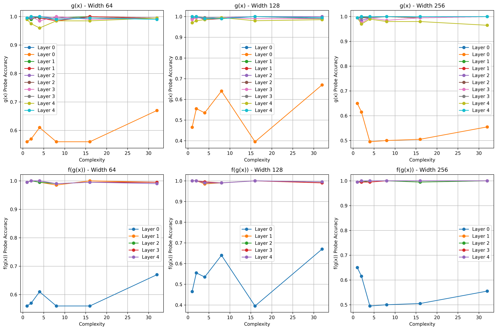
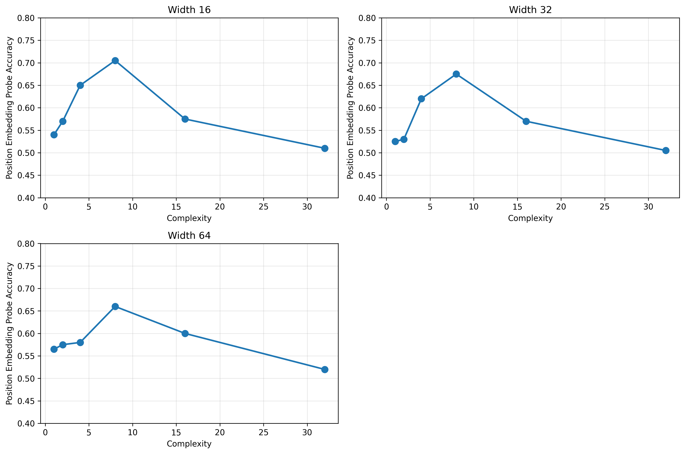
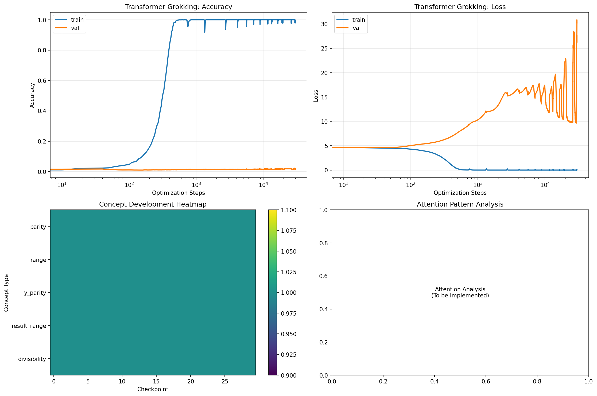
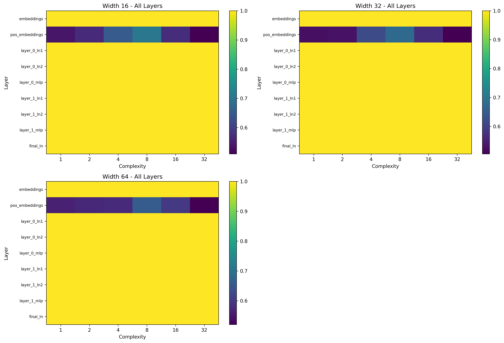

# Layerwise Development of Compositional Functional Representations Across Architectures


This repository investigates how concepts emerge and become linearly decodable from internal activations as neural networks scale in capacity. We study both Multi-Layer Perceptrons (MLPs) and Transformer architectures to understand how circuit emergence differs between architectures.

## Overview

The project implements 7 key steps for studying circuit emergence:

1. **Basic Probing** - Linear decoding of concepts from activations
2. **Complexity Analysis** - How concept emergence scales with model capacity
3. **Layer-wise Analysis** - Where in the network concepts emerge
4. **Composite Function Analysis** - How networks learn f(g(x)) vs g(x)
5. **Symmetry Tests** - Invariance properties of learned representations
6. **Phase Change Detection** - When concepts suddenly become decodable
7. **Grokking Experiments** - Concept emergence during extended training

## Key Results

### MLP Results
- **Concept Emergence**: Simple concepts (parity, range) emerge early, complex concepts (symmetry, oscillations) emerge later
- **Capacity Scaling**: Wider networks show faster concept emergence
- **Layer Analysis**: Concepts emerge progressively from early to late layers
- **Composite Functions**: Networks learn both g(x) and f(g(x)) concepts simultaneously

### Transformer Results
- **Position Embeddings**: Show meaningful concept emergence patterns
- **Attention Analysis**: Self-attention weights reveal concept-specific patterns
- **Sequence Processing**: Transformers handle discrete tokenized inputs effectively
- **Modular Arithmetic**: Successfully learn modular addition and division

## Key Visualizations

### MLP Complexity Analysis

*How concept emergence scales with model width in MLPs. Simple concepts (parity, range) emerge early, while complex concepts (symmetry, oscillations) require more capacity.*

### MLP Composite Function Analysis

*Dual probing results showing how MLPs learn both g(x) and f(g(x)) concepts simultaneously in composite functions.*

### Transformer Position Embeddings

*Position embeddings show meaningful concept emergence patterns in transformers, with accuracy peaking at moderate complexity levels.*

### Transformer Grokking Analysis

*Comprehensive analysis of transformer grokking behavior, showing training dynamics and concept development over time.*

### Transformer vs MLP Comparison

*Comparison of concept emergence across all transformer layers, showing how different layers encode information at varying complexity levels.*

## Technical Details

### Datasets
- **Synthetic Functions**: Polynomial, sine, ReLU, and composite functions
- **Modular Arithmetic**: Addition and division in finite fields
- **Continuous vs Discrete**: Support for both continuous (MLP) and discrete (Transformer) inputs

### Model Architectures
- **MLP**: Multi-layer perceptrons with configurable width and depth
- **Transformer**: Self-attention based models with positional embeddings
- **Configurable**: Width, depth, number of heads, sequence length

### Probing Framework
- **Linear Probes**: Ridge regression for concept decoding
- **Multi-layer Support**: Probe all layers and attention heads
- **Balanced Concepts**: Ensure concepts have balanced class distributions
- **Cross-validation**: Robust evaluation of probe performance

## Usage

### Setup
```bash
cd py/02-circuit-emergence
pip install -r requirements.txt
```

### Running Experiments
```bash
# Basic probing
python main.py

# Complexity sweep
python complexity_sweep.py

# Composite analysis
python composite_analysis.py

# Symmetry tests
python symmetry_analysis.py

# Grokking experiments
python transformer_grokking_experiment.py
```

### Configuration
Edit `params.yaml` to configure:
- Model architecture (MLP/Transformer)
- Model capacity (width, depth)
- Dataset parameters
- Training hyperparameters
- Probing settings

## Key Files

### Core Implementation
- `model.py` - MLP and Transformer model definitions
- `dataset.py` - Data generation and preprocessing
- `probe_utils.py` - Linear probing framework
- `transformer_probe_utils.py` - Transformer-specific probing

### Analysis Scripts
- `complexity_sweep.py` - Step 4: Complexity analysis
- `composite_analysis.py` - Step 5: Composite function analysis
- `symmetry_analysis.py` - Step 6: Symmetry tests
- `transformer_grokking_experiment.py` - Step 7: Grokking experiments

### Utilities
- `plotting.py` - Visualization utilities
- `phase_change_detection.py` - Step 6: Phase change detection
- `test_*.py` - Various test and debugging scripts

## Results Directory

The `results/` directory contains:
- Trained model checkpoints
- Probing results and metrics
- Concept emergence timelines
- Phase change detection results

## Plots Directory

The `plots/` directory contains:
- Concept development plots
- Complexity emergence visualizations
- Composite function analysis
- Symmetry and grokking results
- `important_plots/` - Key visualizations for the paper

## References

This work builds on:
- Linear probing techniques for analyzing neural representations
- Circuit emergence literature in deep learning
- Grokking phenomenon in neural networks
- Transformer architecture analysis

## LICENSE
Copyright (c) 2025 Jeyashree Krishnan and Ajay Mandyam Rangarajan
All rights reserved.
