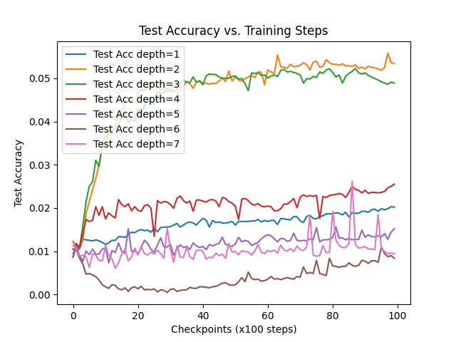

# Apart Hackathon Projects

## 01-grokking-hessian

This project studies how the sharpness of the loss landscape (measured by the top Hessian eigenvalue) changes during training on a modular addition task, and how this depends on model depth.

We:
- Train MLPs of different depths on modular addition (x + y mod p)
- Track loss, accuracy, top Hessian eigenvalue, and gradient norm during training (topmost eigenvalue is always computed)
- Compare how these metrics change with model depth
- Optionally compute the Hessian spectrum (top k eigenvalues) for small models (spectrum computation breaks for models greater than 2 or 3 layers due to memory limits)
---

#### How to Run

1. Set up virtual environment:

```bash
python3 -m venv venv
source venv/bin/activate  # or .\venv\Scripts\activate on Windows
pip install -r requirements.txt
```

2. Train the models and generate plots:

```bash
python main.py
```

This will train MLPs of depth 1–7 on a modular addition task and save:
- Train/test loss traces
- Top Hessian eigenvalue traces
- Gradient norm traces
- Accuracy curves
- (For small models) Hessian spectrum traces

All plots will be saved in the plots/ directory, and intermediate results in results/.

---

#### Workflow Overview

Script flow:

```
+-------------------+
| dataset.py        |  -- generates modular addition dataset
+-------------------+
           |
           v
+-------------------+
| train.py          |  -- trains MLPs, logs losses, Hessian, accuracy, etc.
+-------------------+
           |
           v
+-------------------+
| results/*.pt      |  -- stores all traces and metrics
+-------------------+
           |
           v
+-------------------+
| plotting.py       |  -- generates plots from results
+-------------------+
           |
           v
+-------------------+
| plots/*.png       |  -- final visualizations
+-------------------+
```

You can run everything with:
```
main.py  # runs train.py then plotting.py
```
- You can run python plotting.py separately to regenerate plots from existing results.
- Adjust model/training parameters in train.py as needed for further experiments.

---

#### Datacard: Modular Addition Dataset
- Task: Predict (x + y) mod p for integers x, y in [0, p-1], p=97 (used in the reference papers).
- Generation: All (x, y) pairs are created. 10% are randomly selected for training, the rest for testing.
- Inputs: 2D integer vectors (x, y).
- Targets: Integer in [0, p-1] (class index).
- Properties: Small, synthetic, algorithmic; no noise; fixed random split.

#### Modelcard: MLP Architecture (adapted from the reference papers)
- Type: Multi-layer perceptron (MLP)
- Input: 2D vector (x, y)
- Output: 97-way classification (one-hot for (x + y) mod 97)
- Hidden layers: Variable (1–7), each with 128 units and ReLU activation
- Output layer: Linear, 97 units
- Loss: Cross-entropy
- Optimizer: Adam, lr=1e-3

---

#### Hessian Spectrum Computation (Important Note)
- The script can compute the top eigenvalues (spectrum) of the Hessian for small models (e.g., hidden_dim ≤ 32 and n_layers ≤ 3).
- For larger models, computing the full Hessian is infeasible due to memory and computational constraints (the Hessian is a very large matrix: number of parameters squared).
- For large models, the spectrum is skipped and the plots will be empty or show a warning. This is by design to avoid crashes (SIGBUS or out-of-memory errors).
- To see meaningful spectrum plots, set smaller values for hidden_dim and depths in params.yaml (e.g., hidden_dim: 16, depths: [1, 2, 3]).

---

#### Results

Most, if not results below have to be run for longer training steps to probably say anything conclusive.

##### Hessian Curvature vs. Training
- Top eigenvalues increase with model depth, suggesting deeper models enter sharper regions.
- However, deeper models (depth >= 4) do not necessarily grok — they show high curvature without generalization.


##### Loss vs. Steps
- Shallower models (depth 2–3) show a clear transition in test loss from memorization to generalization (classic grokking curve).
- Deeper models (depth >= 4) either overfit or plateau at high test loss; their test loss does not decrease significantly.


##### Test Accuracy
- Only depth 2 consistently reaches high test accuracy.
- Generalization (test accuracy) does not monotonically improve with depth; deeper models do not generalize well.



---

#### Hessian

Second-order partial derivatives of the loss function with respect to the model parameters. It measures the curvature of the loss landscape:

$$
H(\theta) = \nabla^2_{\theta} \mathcal{L}(\theta)
$$

Each entry of the Hessian is:

$$
H_{ij} = \frac{\partial^2 \mathcal{L}(\theta)}{\partial \theta_i \partial \theta_j}
$$

We compute the top eigenvalue of the Hessian to estimate how sharp the loss surface is around the current parameter vector $\theta$. A larger eigenvalue implies greater sensitivity to parameter changes.

The vector $\theta$ contains all trainable parameters of the MLP — that is, the weights and biases from each linear layer:

$$
\theta = [W_1, b_1, W_2, b_2, \dots, W_n, b_n]
$$

For an MLP with depth $d$ and hidden dimension $h$, the size of $\theta$ is approximately:

$$
|\theta| = 2h + h + (d-2)(h^2 + h) + 97h + 97
$$

We track how the curvature of the loss with respect to $\theta$ changes during training and how it correlates with generalization.


#### References

- Grokking: "Learning Algorithmic Tasks by Tuning Gradient Descent"
  [NeurIPS 2022 Paper](https://proceedings.neurips.cc/paper_files/paper/2022/hash/dfc310e81992d2e4cedc09ac47eff13e-Abstract-Conference.html)
- Base implementation: https://github.com/teddykoker/grokking
- Sharpness analysis inspiration: https://github.com/LucasPrietoAl/grokking-at-the-edge-of-numerical-stability
- Hessian top eigenvalue computation: custom autograd implementation (similar to PyHessian/BackPACK)
- [openai/grok](https://github.com/openai/grok)

---

## 02-circuit-emergence: Circuit Emergence with Model Scaling

### Goal
This part investigates how a fixed concept (e.g., whether x % 2 == 0) becomes linearly decodable from internal activations of MLPs as the model width increases. Inspired by the “progress measures” approach to mechanistic interpretability, this LIU adapts the method to a minimal MLP setting.

---

### How to Run

1. Set up virtual environment (if not already):
```bash
python3 -m venv venv
source venv/bin/activate  # or .\venv\Scripts\activate on Windows
pip install -r requirements.txt
```

2. Run the full pipeline (training, probing, plotting):
```bash
python py/02-circuit-emergence/main.py
```

- Models and checkpoints are saved in `checkpoints/`.
- Probe results are saved in `results/`.
- Plots are saved in `plots/`.

---

### Generating Plots
- Plots of probe accuracy vs. layer for each width: `plots/probe_accuracy_vs_layer_width*.png`
- Aggregate plot of probe accuracy vs. width: `plots/probe_accuracy_vs_width.png`

---

### Workflow Overview

```
+-------------------+
| dataset.py        |  -- generates modular addition dataset
+-------------------+
           |
           v
+-------------------+
| train_models.py   |  -- trains MLPs of various widths
+-------------------+
           |
           v
+-------------------+
| checkpoints/      |  -- stores trained models
+-------------------+
           |
           v
+-------------------+
| run_probe.py      |  -- extracts activations, runs probes
+-------------------+
           |
           v
+-------------------+
| results/          |  -- stores probe accuracies
+-------------------+
           |
           v
+-------------------+
| plotting.py       |  -- generates probe accuracy plots
+-------------------+
           |
           v
+-------------------+
| plots/            |  -- final visualizations
+-------------------+
```

---

### Datacard: Modular Addition Dataset
- Task: Predict (x + y) mod p == 0 for integers x, y in [0, p-1], p=97 (default).
- Generation: All (x, y) pairs are created. Split into train/test by `train_frac` in `params.yaml`.
- Inputs: 2D integer vectors (x, y).
- Targets: Binary label (1 if x + y mod p == 0, else 0).
- Properties: Small, synthetic, algorithmic; no noise; fixed random split.

### Modelcard: MLP Architecture
- Type: Multi-layer perceptron (MLP)
- Input: 2D vector (x, y)
- Output: p-way classification (for modular addition)
- Hidden layers: Variable width (e.g., 16, 32, 64, 128, 256), fixed depth
- Output layer: Linear, p units
- Loss: Cross-entropy
- Optimizer: Adam, lr configurable in `params.yaml`

---

### Results
- Probe accuracies are saved for each layer and width in `results/probe_accuracies.pt`.
- Plots show how well a concept (e.g., x % 2 == 0) can be decoded from each layer as width increases.
- Aggregate plot shows emergence of decodability as model capacity grows.

#### Probe Accuracy vs. Layer (per width)
For each model width, the following plots show probe accuracy (decodability of the concept) at each layer:


#### Aggregate: Probe Accuracy vs. Width
This plot shows how probe accuracy for each layer changes as model width increases:


---

### This is a starting point for
- Applies probing and interpretability methods to MLPs, not just transformers.
- Explores when and where concepts emerge as model capacity increases.

---

### References
- Liu, B., Olsson, C., Hilton, J., & Ganguli, S. (2023). Progress measures for grokking via mechanistic interpretability. https://github.com/mechanistic-interpretability-grokking/progress-measures-paper
- Elhage, N., et al. (2022). A mathematical framework for transformer circuits. https://transformer-circuits.pub/2022/framework/index.html
- Power, A., et al. (2022). Grokking: Generalization slowly emerges during training. NeurIPS 2022. https://proceedings.neurips.cc/paper_files/paper/2022/hash/dfc310e81992d2e4cedc09ac47eff13e-Abstract-Conference.html
- Ayyuce Kızrak (2023). Mechanistic Interpretability Projects Repository. https://github.com/ayyucekizrak/Mechanistic-Interpretability
- Hewitt, J., & Manning, C. D. (2019). A structural probe for finding syntax in word representations. https://aclanthology.org/N19-1162

---


