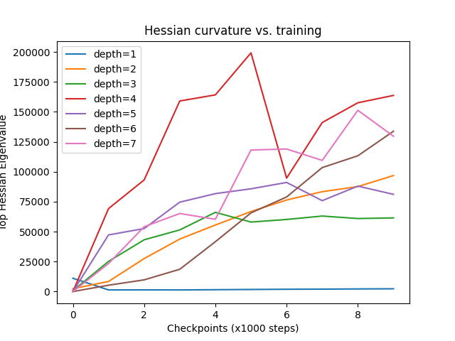
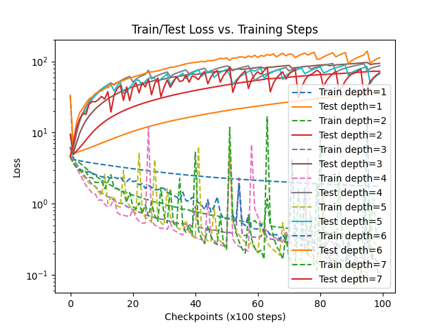
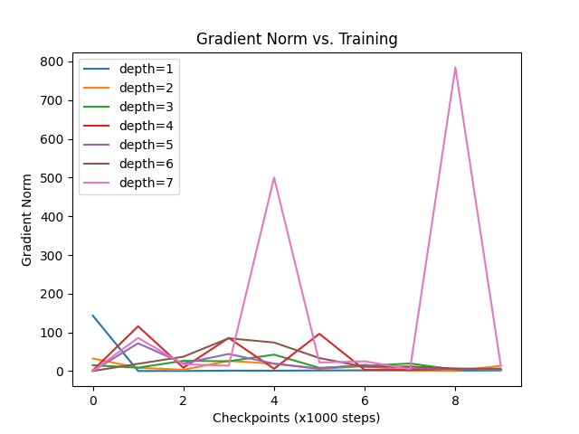

# Apart Hackathon Projects

## 01-grokking-hessian

This project studies how the sharpness of the loss landscape (measured by the top Hessian eigenvalue) changes during training on a modular addition task, and how this depends on model depth.

We:
- Train MLPs of different depths on modular addition (x + y mod p)
- Track loss, accuracy, Hessian eigenvalue, and gradient norm during training
- Compare how these metrics change with model depth

---


#### How to Run

1. Set up virtual environment:

```bash
python3 -m venv venv
source venv/bin/activate  # or .\venv\Scripts\activate on Windows
pip install -r requirements.txt
```

2. Train the models and generate plots:

```bash
python main.py
```

This will train MLPs of depth 1–7 on a modular addition task and save:
- Train/test loss traces
- Top Hessian eigenvalue traces
- Gradient norm traces
- Accuracy curves

All plots will be saved in the plots/ directory, and intermediate results in results/.

---

#### Workflow Overview

Script flow:

```
+-------------------+
| dataset.py        |  -- generates modular addition dataset
+-------------------+
           |
           v
+-------------------+
| train.py          |  -- trains MLPs, logs losses, Hessian, accuracy, etc.
+-------------------+
           |
           v
+-------------------+
| results/*.pt      |  -- stores all traces and metrics
+-------------------+
           |
           v
+-------------------+
| plotting.py       |  -- generates plots from results
+-------------------+
           |
           v
+-------------------+
| plots/*.png       |  -- final visualizations
+-------------------+
```

Alternatively, run everything with:
```
main.py  # runs train.py then plotting.py
```
- You can run python plotting.py separately to regenerate plots from existing results.
- Adjust model/training parameters in train.py as needed for further experiments.

---

#### Datacard: Modular Addition Dataset
- Task: Predict (x + y) mod p for integers x, y in [0, p-1], p=97.
- Generation: All (x, y) pairs are created. 10% are randomly selected for training, the rest for testing.
- Inputs: 2D integer vectors (x, y).
- Targets: Integer in [0, p-1] (class index).
- Properties: Small, synthetic, algorithmic; no noise; fixed random split.

#### Modelcard: MLP Architecture
- Type: Multi-layer perceptron (MLP)
- Input: 2D vector (x, y)
- Output: 97-way classification (one-hot for (x + y) mod 97)
- Hidden layers: Variable (1–7), each with 128 units and ReLU activation
- Output layer: Linear, 97 units
- Loss: Cross-entropy
- Optimizer: Adam, lr=1e-3

---

#### Results

##### Hessian Curvature vs. Training
- Top eigenvalues increase with model depth, suggesting deeper models enter sharper regions.
- However, deeper models (depth >= 4) do not necessarily grok — they show high curvature without generalization.



##### Loss vs. Steps
- Shallower models (depth 2–3) show a clear transition in test loss from memorization to generalization (classic grokking curve).
- Deeper models (depth >= 4) either overfit or plateau at high test loss; their test loss does not decrease significantly.



##### Gradient Norms
- Deeper models show noisy, unstable gradient behavior — possibly related to training instability near edge-of-stability regions.



##### Test Accuracy
- Only depth 2 consistently reaches high test accuracy.
- Generalization (test accuracy) does not monotonically improve with depth; deeper models do not generalize well.


---

#### References

- Grokking: "Learning Algorithmic Tasks by Tuning Gradient Descent"
  [NeurIPS 2022 Paper](https://proceedings.neurips.cc/paper_files/paper/2022/hash/dfc310e81992d2e4cedc09ac47eff13e-Abstract-Conference.html)
- Base implementation: https://github.com/teddykoker/grokking
- Sharpness analysis inspiration: https://github.com/LucasPrietoAl/grokking-at-the-edge-of-numerical-stability
- Hessian top eigenvalue computation: custom autograd implementation (similar to PyHessian/BackPACK)
- [openai/grok](https://github.com/openai/grok)

---


